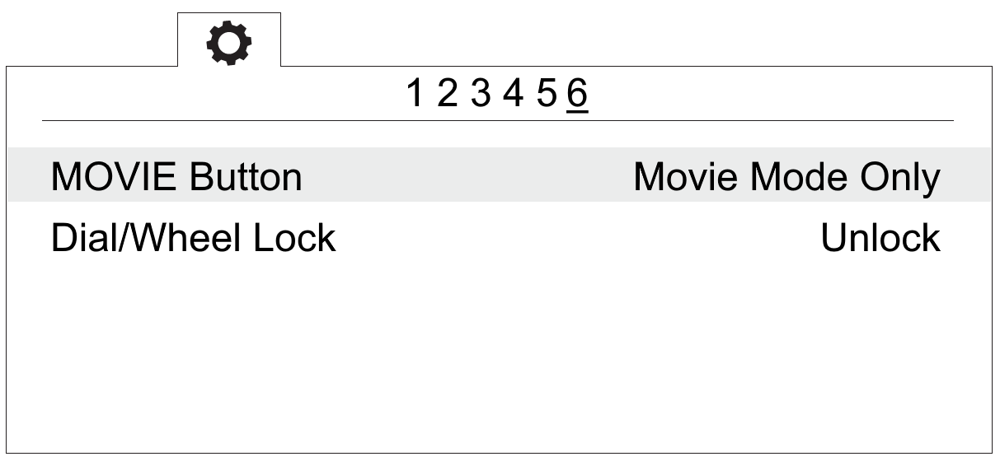
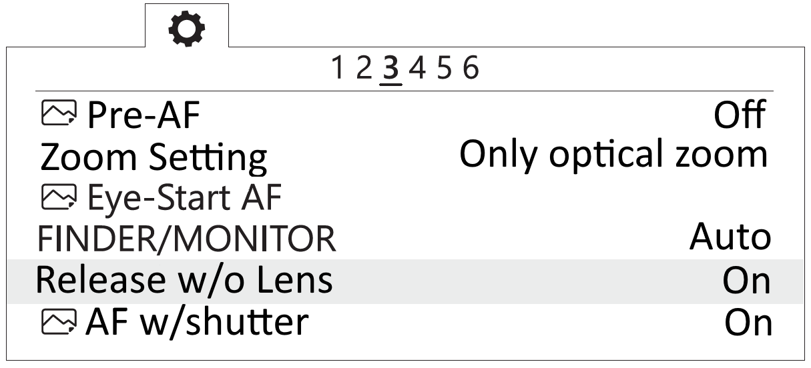

Camera Settings
=========================

.. |icon_cam| image:: _static/_images/icon_cam.png
    :width: 25

.. |icon_set| image:: _static/_images/icon_set.png
    :width: 25

.. |icon_bag| image:: _static/_images/icon_bag.png
    :width: 25

.. |icon_sd| image:: _static/_images/icon_sd.png
    :width: 25

.. |icon_key| image:: _static/_images/icon_key.png
    :width: 25

This section contains recommended settings for cameras. 

Camera type depends on delivery kit.

Sony DSC-RX1RM2 Settings
------------------------------------------

Before changing any settings, carfully read `Camera Operating Instructions <https://www.sony.com/electronics/support/res/manuals/4579/45798651M.pdf>`_ to get information about functions and control elements.

Basic camera control elements showed on the picture.

Camera presets
___________________

By default, Geoscan UAVs equipped with Sony DSC-RX1RM2 cameras are shipped with 2 presets.

Use **Mode dial** near ``on\off`` switcher to select preset for your needs.

*Preset 1* serves for shooting in normal daylight conditions. The aperture value is fixed, which provides fixed exposure of photos for better ortophotomosaic generation.

Use these settings for this mode:

* Set **Mode dial** in **1** position.
* Set **Focus mode dial** in **MF** position.
* Set **Macro switching ring** in **0,3m-∞** position.
* Set **Aperture ring** in **4,5** (first mark after 4)

*Preset 2* — universal set with automatic variable exposure control (Shutter Priority).

Use these settings for this mode:

* Set **Mode dial** in **2** position.
* Set **Focus mode dial** in **MF** position.
* Set **Macro switching ring** in **0,3m-∞** position.

The aperture value is not taken into account.

*Preset 3* can be used for user settings.

Select settings in menu and go to |icon_cam| camera settings (tab 8) and select **Memory**.

Set **Mode dial** in **3** position and press button in the middle of **Control wheel**.

Restoring presets
___________________

Settings of 1 and 2 presets can be restored, if you change it. 

For preset 1 restoring:

* Set **Mode dial** in position **M** (Manual aperture control).
* Set shutter speed **1/1000** by **Control dial**.
* Select **ISO** — **Auto** in camera menu.

Press menu button, go to |icon_cam| camera settings (tab 8) and select **Memory**.

Set **Mode dial** in **1** position and press button in the middle of **Control wheel**.

For preset 2 restoring:

* Set **Mode dial** in position **S** (Shutter priority).
* Set shutter speed **1/1000** by **Control dial**.
* Select **ISO** — **Auto** in camera menu.

Press menu button, go to |icon_cam| camera settings (tab 8) and select **Memory**.

Set **Mode dial** in **2** position and press button in the middle of **Control wheel**.

If you change or reset settings you also need to switch off automatic photo review and shooting by MOVIE button, set maximum time before powersaving start and reset for file number. Change these settings:

* Switch off **Auto Review** in |icon_set| user settings (tab 2) and **MOVIE Button** — **Video Mode Only**.

.. figure:: _static/_images/RX1RM2_menu2.png
   :width: 400
   :align: center

   Auto review — off

   «Video mode only» for MOVIE button

* In |icon_bag| settings section set **Power Saving Start Time** — **30 min.** (tab 2) и **File Number** — **Reset** (tab 5).

.. figure:: _static/_images/RX1RM2_pwr_save.png
   :width: 400
   :align: center

   Power saving start time

   File number reset

SD Card Formating
______________________

* In |icon_bag| settings menu (tab 5) select **Format**.

.. figure:: _static/_images/format_en.png
   :width: 400
   :align: center

   «Format» option

.. attention::  All data on SD card will be deleted!

Settings reset
________________

Reset of the camera will delete presets' shooting settings (Presets 1 and 2)!

1) In |icon_bag| settings menu (tab 6) select **Setting Reset**

.. figure:: _static/_images/reset_en.png
   :width: 400
   :align: center

   «Setting reset» option

.. attention::  Do not remove the battery during a reset process!

2) After camera reboot, you need to set **Timezone and date**, otherwise the settings will not be saved and this menu will appear at every turn on.

3) Use ON/OFF switcher to turn the camera off.
4) Wait 3 minutes for all settings to be saved (do not disconnect the battery or power cord).

.. important:: **«E:61:00»** error may appear on the screen, as the camera is focused to infinity. **This message will not interfere with camera's function**.

Sony DSC-RX1 Settings
------------------------------------------

Before changing any settings, carfully read `Camera Operating Instructions <https://www.sony.com/electronics/support/res/manuals/4469/44695771M.pdf>`_ to get information about functions and control elements.

* Set mode to **S** (Exposure priority) by mode dial.
* Set exposure **1/800**  by control dial.
* Set exposure to **0** (Zero) by exposure compensation dial.
* Set macro to **0,3m-∞** by macro switching ring.
* Set focus mode dial to **MF**.

To set camera parameters, push **MENU** button, then select parameters according to the following instructions.

* In user settings menu |icon_set| (tab 1) turn off **Automatic preview**.

.. figure:: _static/_images/menu2.png
   :width: 400
   :align: center

   Turn off automatic preview

* Turn off **RF assist** and set **Extend focus time** - **No restrictions** (2 tab).

.. figure:: _static/_images/menu13.png
   :width: 400
   :align: center

   Turn off RF assist and focus time extend setting.

* Set **MOVIE** - **Video mode only** (tab 3).

.. figure:: _static/_images/menu11.png
   :width: 400
   :align: center

   Set video mode only

* In settings menu |icon_key| tab 2 set **Power saving time** - **30 min** .

.. figure:: _static/_images/menu1.png
   :width: 400
   :align: center

   Power saving time 

* In memory card menu |icon_sd| select**File №** - **Clear**.

.. figure:: _static/_images/menu3.png
   :width: 400
   :align: center

   Clear file number

Other settings should not be changed as they are used in default mode.

**SD Card Formating**

1) Select **MENU →** |icon_sd| **[Memory card]** **→ Format**

**All Settings Reset**

Follow these steps to set default settings:

1) Select **MENU** → **Settings menu** → **INITIALISATION** → **Reset**

.. attention::  Do not remove the battery during a reset process!

2) After camera reboot, you need to set **Timezone and date**, otherwise the settings will not be saved and this menu will appear at every turn on.

3) Use ON/OFF switcher to turn the camera off.
4) Wait 3 minutes for all settings to be saved (do not disconnect the battery or power cord).

.. important:: **«E:61:00»** error may appear on the screen, as the camera is focused to infinity. **This message will not interfere with camera's function**.

Sony A6000 Camera Setup
------------------------------------

.. |icon_cam| image:: _static/_images/icon_cam.png
    :width: 25

.. |icon_key| image:: _static/_images/icon_key.png
    :width: 25

.. |icon_set| image:: _static/_images/icon_set.png
    :width: 25

.. |icon_bag| image:: _static/_images/icon_bag.png
    :width: 25

.. |icon_sd| image:: _static/_images/icon_sd.png
    :width: 25

Read the camera's `full operating instructions <https://www.sony.co.uk/electronics/support/res/manuals/4532/45320554M.pdf>`_ to know about main control elements before make settings.

* Set the mode dial to **S** (Shutter Priority).

Use the control wheel to set the following parameters:

.. csv-table:: 
   :align: center 

   "**Exposition**", "**1/1000**"
   "**ISO**", "**Auto**"

* In still shooting menu |icon_cam| (tab 2) set **Focus Mode** - **Manual focus**.

.. figure:: _static/_images/camera/menu4.png
   :align: center
   :width: 400

   Focus Mode

* In custom settings menu |icon_set| (tab 1) disable **Automatic preview**.

.. figure:: _static/_images/camera/menu5.png
   :align: center
   :width: 400

   Automatic preview off

* In custom settings menu |icon_set| (tab 3) turn on **Lens-less Shutter**.

   Turn on the shutter without a lens

* In custom settings menu |icon_set| (tab 6) set the **MOVIE** button - **Video mode only**.

   Set "Video Mode Only"

* In setup menu |icon_bag| (tab 2) set **Start time energy saving** - **30 min**.

.. figure:: _static/_images/camera/menu8.png
   :align: center
   :width: 400

   Set the time to start energy saving

* In setup menu |icon_bag| (tab 5) set **File Number** - **Reset**.

.. figure:: _static/_images/camera/menu9.png
   :align: center
   :width: 400

   Reset file number

**Format SD card**

1) Select **MENU →** |icon_bag| [Setup] **→ Format**

.. attention::  All data will be deleted!

Sony A6000 NIR Modification Setup
-------------------------------------

The following options are set in still shooting menu menu:

* **Quality** - **RAW** in still shooting menu (Tab 1);

.. figure:: _static/_images/camera/menu10.png
   :align: center
   :width: 400

   Set the quality

* **ISO** up to 400 (press the control wheel right to select);

* **Exposure compensation** from EV **+1** to EV **+2** (press the control wheel down to select).

