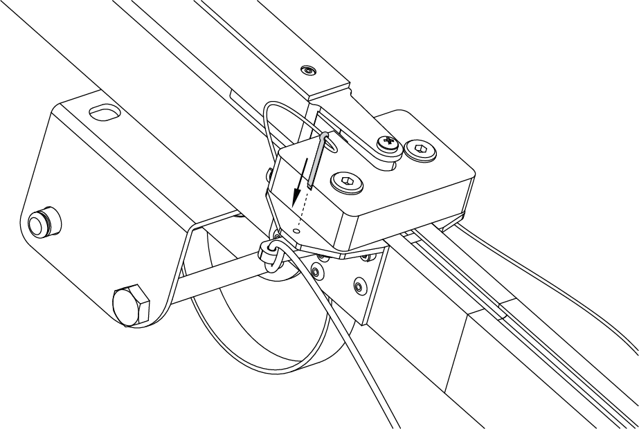

Launcher
=====================

Assembly
----------

1) Take out the launcher parts from the transport bag.
2) Spread out the supports on the launcher front part. Make sure that they are securely fastened by locks. To fold the supports pull the locks down.

.. figure:: _static/_images/catapult/catapult1.png
   :align: center
   :width: 400

   Installation of the supports

3) Attach the launcher's middle part.

.. figure:: _static/_images/catapult/catapult2.png
   :align: center
   :width: 400

   Attaching of the launcher's middle part

4) Attach the launcher's rear part.

   Attaching of the launcher's rear part

5) Insert the locking pin into the hole in the launcher's middle and rear part.

6) Place the launcher on a flat surface. The UAV must be launched against the wind. Make sure that the launcher is stable on the ground and that its guide has no roll. If it needs, bury one of the supports to align the launcher.

.. attention:: The launch of the UAV is allowed only against the wind. It is strictly forbidden to launch the UAV in the direction of the wind. Otherwise, the UAV will not be able to correctly gain altitude and may collide with objects on the way.

7) Install and hammer the stop peg into the bracket at the rear part of the launcher to prevent displacements when the UAV starts.

.. attention::The stop peg must be hammered to avoid the launcher jumping at the start of the UAV. Make sure the launcher's rear part does not deform when you hammer on the peg.

The jerk of the rubber cords leads to the throwing of the launcher's rear part, when the UAV starting. You must hammer on the stop peg on the entire length to fix the launcher's rear part. Don't to deform the launcher, when you hammer on the stop peg.

8) Install the carriage onto the guide of the launcher, so that the rails of the carriage slid along the rails.

.. figure:: _static/_images/catapult/catapult4.png
   :align: center
   :width: 700

   Installation of the carriage

.. attention:: Before each start of the UAV make sure that the carriage slides on the rails without catching of the launcher's parts.

9) Move the carriage down until it locks in the lock.
10) Insert the safety pin into the starting mechanism.

   Inserting the safety pin

.. attention:: The lock may accidentally trigger, if you does not insert the pin!

11) Release the winch stopper and unwind the tension cable.
12) Take the rubber cords. Straighten the cords. Make sure the cords are not tangled.
13) Use the rope ring at the end of the rubber cord to make loop and hook the carriage.

.. figure:: _static/_images/catapult/catapult6.png
   :align: center
   :width: 250

   Rope ring loop

14) Connect the another end of the rubber cord to the end of the starting cable by a carabiner. The starting cable must lay through the roller. The carabiner screw-lock must be screwed.
15) Attach the second rubber cord similarly.
16) Put the handle of the winch reel on the axle and slide until the reinforcement mechanism clicks.

.. figure:: _static/_images/catapult/catapult7.png
   :align: center
   :width: 400

   Installing the winch reel handle

Preparation to UAV launch
------------------------------
.. attention:: Pull the cords only after the successful pre-launch preparation immediately before the launch. This will increase their shelf life and ensure safety on the launch area.

1) Move the winch stopper to the cable tension position.

2) Pull the rubber cords by rotating the winch reel handle. In case of contact with the cords between the roller and the launcher's parts or break from the roller, it is necessary to stop the tension of the cords. Displaced cable should be placed on the roller. Continue to pull the rubber cords only after that.

On the launcher's middle part engraved "STOP" marker. You must stop the cords stretching, when carabiners will be opposite to it.

Now the UAV can be placed on the launcher.

Rules of use the rubber cords
------------------------------

* Check the condition of the rubber bands regularly. Replace the damaged ring by a spare ring from the spare parts kit, if damages are found.
* Don't keep the rubber cords stretched for a long time. Stretch the cords directly before placing the UAV on the launcher.
* Do not allow long-term exposure of rubber cords in direct sunlight in a warm season.
* Do not allow the rubber cords to freeze in a cold season. Before to installation keep them in a warm place and pull directly before starting. Immediately remove the cords from the launcher and put them to a warm place after the UAV starts.
