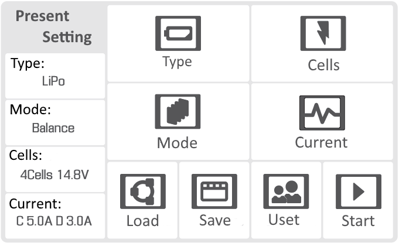
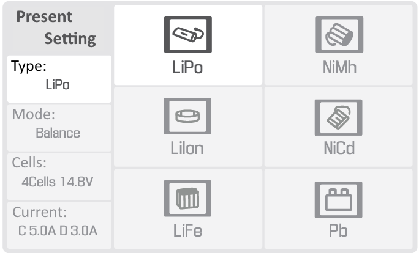
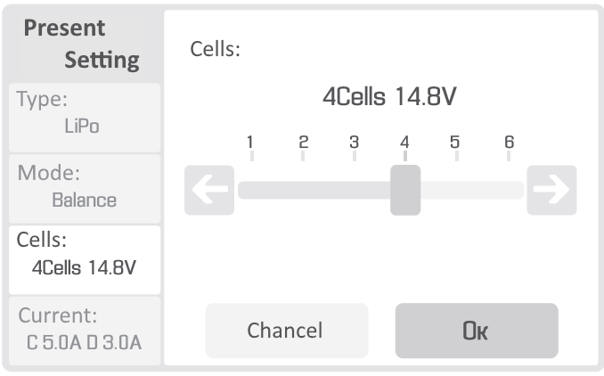
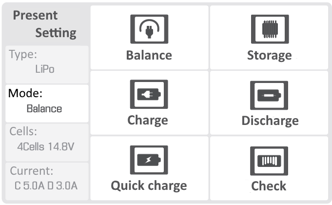
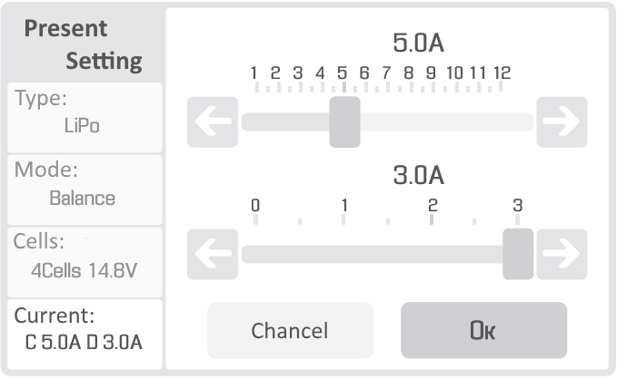
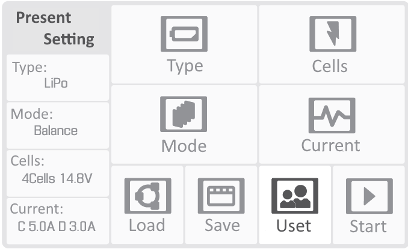
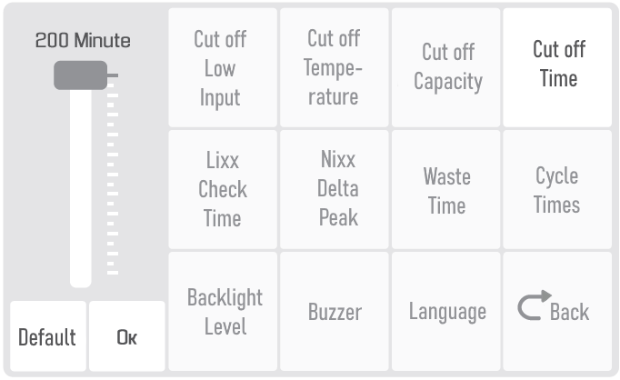
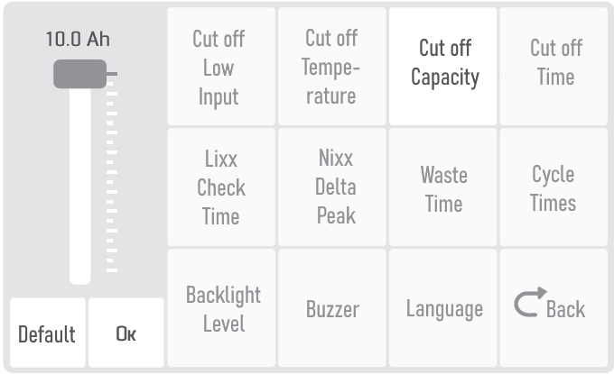
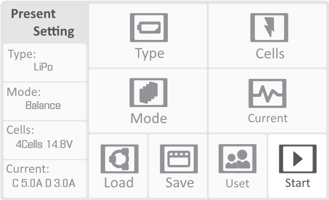

Charger and battery
=========================

.. csv-table:: **Battery specifications**
   
   "Guaranteed number of charge-discharge cycles", "50"
   "Higher charge limit", "16.8 V"
   "Lower discharge limit", "13.2 V"
   "Charging current", "<10 А"
   "Number of cells", "4"
   "Capacity", "10 000 mAh"

Safety requirements
----------------------

**Battery**

* Don't disassemble or deform the battery (don't drop and pierce).
* Don't allow heat the battery more than 60 degrees.
* Don't overcharge the battery (over 42V). 
* Don't allow the battery discharge below 30V.
* Don't store battery fully discharged. For long-term battery storage (a month or more) it must be transferred to the **Storage** mode by the battery charger.
* Don't charge battery by currents more than charge limit (no more than 100% of the capacity. We recommended to charge 50% of the capacity to extend the battery's life cycle). Current more than the limit will heat the battery over than 60 °C. 

.. attention:: Failure to follow the above instructions may result in fire or battery failure.

**Charger**

* The charger must be switched on before connect the battery with the charger.
* Cables and connectors must be inspected for damage before each use.
* Don't operate the charger in direct sunlight.
* Don't leave the charger without supervision.

The charger is configured from the factory. Follow the instructions to config preset, if the settings are different.

Battery charger preset
---------------------------------

You will see main menu, when you turn on the charger. You can set parameters by using the touch screen.

**Set battery charge parameters:**

In **Type** section select **LiPo**:

In **Cells** section select **4Cells** **14.8V**:

In **Mode** section select:

* **Balance only** for the battery charge.

* **Storage** to transfer the battery to storage mode.

* **Charge** to charge the battery without balancing the voltage on the elements (not recommended to charge in this mode).

* **Discharge** for battery discharge.

* **Quick Charge** for charging with high currents (not recommended to charge in this mode).

* **Checker** to check battery status.

In **Current** section set **Charge: 5.0А**, **Discharge: 3.0А**:

Select **Uset** section:

In **Uset** section set **Cutoff Time** *200 Minute*:

In **Uset** section set **Cutoff Capacity** *10.0 Ah*:

Battery charging
---------------------
* Plug the AC power cable into the charger.

* Plug the cable into a outlet.

* Connect the balancing cable to the battery.

* Connect the power cable connector to the battery.

* Check the charger settings and start the charge process by long (3 seconds) clicking on icon **Start**.

* Disconnect the battery after charging in reverse order.

Lithium polymer (LiPo) battery recommendations on the use 
---------------------------------------------------------------------

The following rules must be observed to prevent dangerous situations:

The battery must be stored in a warm place before launch for a flights in a temperature lower than 0 °C. LiPo batteries 
can lose up to 30% of a capacity in cold. You need to pay attention to this, when you're planning a flight task.

The battery must be stored in a cool place before launch for a flights in temperature above 25 °C protected from direct sunlight. Don't charge the battery immediately before flight. It should cool down. Charge the battery only in a cool and protected from direct sunlight place.

Battery check
---------------------------------
We recommended to carry out a full charge/discharge cycle for a check battery status.

1) Charge the battery.
2) Discharge the battery to 13.5 V by select **Discharge** mode.
3) Recharge the battery.

Storage and discharge
--------------------------------------------

Put the battery in storage mode, if you don't plan to use it for more than 14 days.

You need to change **Balance** to **Storage** mode to do that. Check the correct number of cells on the screen (4 Cells) and start it by a long press **Start** button.

Batteries should be stored in a cool and dry place, without direct sunlight, at a temperature of 5 to 25 °C and a relative humidity of 80% without condensation.

The normal temperature is from 5 to 10 °C.

The normal voltage level for storage mode: 15,4 V. 

Battery service life - 1 year.

Battery recycling
-------------------

.. attention:: Don't throw LiPo batteries with household trash. It may be dangerous for ecology. Send them to recycling points.
