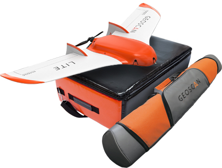

.. 101-doc documentation master file, created by
   sphinx-quickstart on Fri Dec 21 11:13:03 2018.
   You can adapt this file completely to your liking, but it should at least
   contain the root `toctree` directive.

Geoscan Lite Instruction Manual
======================================

Geoscan Lite – compact aerial survey system.

**Application**

Geoscan Lite is designed to obtain georeferenced photos of objects and aerial photography. 

The aerial data can be used for:

* Terrain evaluaton;
* Aerial photography with precise time stamps for georeferenced images;
* Orthophotos and digital terrain models creation;
* Altitude maps creation;
* 3D terrain models;
* Volumetric calculation for quarries and fills

Kit
---------------------

* Geoscan Lite unmanned aerial vehicle (UAV) 
* UAV transport bag
* Launcher in transport bag
* Customized camera
* Battery
* Radio modem with antenna
* Battery charger
* Geoscan Planner software
* Folding rack
* Spare parts and accessories:

   * Fin — 2 PCs;
   * Wings mounting rod (460 mm);
   * Stop peg for launcher;
   * Rubber cords for launcher;
   * Propeller blades (8x10);
   * Wrench;
   * Pitot tube (brass, 70 mm);
   * Pitot tube cleaning rod (wire, 150 mm);
   * Silicon tube;
   * Utility knife.

Specifications
----------------------

.. csv-table:: 

   "UAV type", "fixed wing"
   "Flight speed", "72 — 108 km/h"
   "Max takeoff weight", "3.1 kg"
   "Max payload weight", "0.8 kg"
   "Shooting area in one flight","up to 9 km²"
   "Max wind speed","12 m/s"
   "Wingspan", "1.38 m"
   "Min safe flight altitude","100 m"
   "Max flight altitude","4000 m"
   "Engine","electric, brushless"
   "Battery","LiPo 14.8 V"
   "Preparation time before takeoff","10 min"
   "Flight duration", "up to 60 min"
   "Max flight length","70 km"
   "Takeoff mechanism","catapult"
   "Landing","parachute,in automatic mode"
   "Operating temperature range:","-20 to +40 °C"

Maintenance service
-------------------------

Visually inspect UAV for a damage after each flight.

If propeller blades or fins are damaged, you can replace them by yourself using spare parts and tools from the kit.

If aircraft or system structural damages are detected, please contact `Geoscan support <https://www.geoscan.aero/en/support>`_.
After 80 flights it is recommended to send your UAV to the manufacturer for inspection and maintenance.

Storage
-----------

Geoscan Lite system (without battery) and launcher are recommended to be stored in transport bags and dry room at a temperature of +5 to +25 °C and relative humidity not more than 80% without condensation. 
Service life — 2 years.

Batteries should be stored in a cool and dry place without direct sunlight, at a temperature of +5 to +25 °C and a relative humidity of 80% without condensation. The optimum temperature — from 5 to 10 °C. The optimum voltage level when placing the battery to storage: 15.12 V. 
Service Life — 1 year.

.. toctree::
   :maxdepth: 2
   :hidden:
   :caption: Contents

   reference
   precautions
   uav
   nsu
   catapult
   camera
   charger
   planner
   launch
