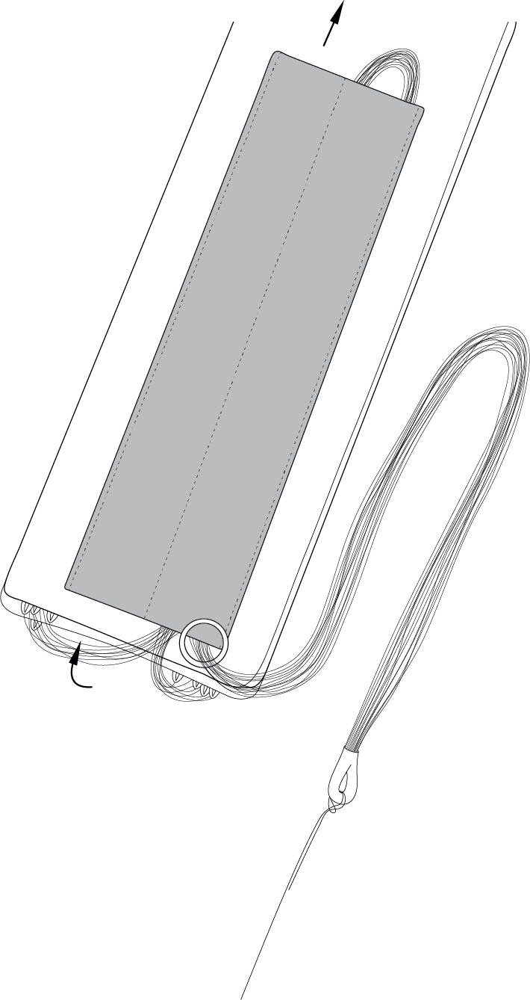
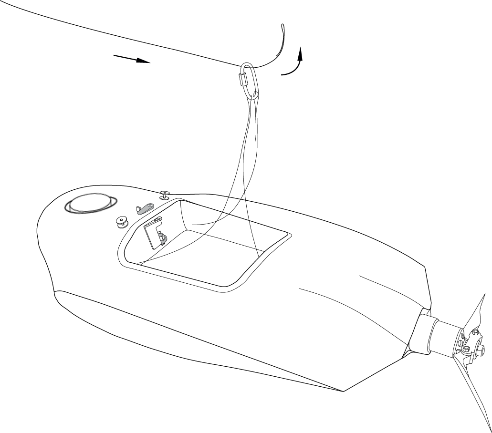

UAV
============

Parts
---------------------------

Assembly
-------------

1) Take the wings and fuselage from the UAV's transport bag.
2) Place the parachute in the parachute compartment (see section **Parachute system** for details).
3) Remove the fuselage's top cover. Unclasp the rubber locks to remove the fuselage's top cover. Remove back of the cover from grooves.

.. figure:: _static/_images/UAV_assembly/asmbl1.png
   :align: center
   :width: 400
   :alt:  Removing the top cover of the fuselage

   Removing the fuselage's top cover

4) Insert mounting rod into the fuselage tube.

.. figure:: _static/_images/UAV_assembly/asmbl2.png
   :align: center
   :width: 400
   :alt: Fuselage

   Puting of the connecting rod

5) Put the wings on the mounting rods and move them to the fuselage limiters.

.. figure:: _static/_images/UAV_assembly/asmbl3.png
   :align: center
   :width: 600
   :alt: Installation of the wings

   Installation of the wings

6) Attach the fins and fix them in place. Make sure the fins are secured by magnets.

.. figure:: _static/_images/UAV_assembly/asmbl4.png
   :align: center
   :width: 400
   :alt: Installation of the keels

   Installation of the keels

7) Connect the wings cable connectors into the appropriate slots in the autopilot.

   Connection of the cables

8) Remove memory cards from autopilot and camera. Format them and put back in slots.
9) Install and lock battery by textile clasp.
10) Connect power connector with the battery.

   Installation of the SD card and the battery. Connection the battery.

11) Set up the camera (see section :doc:`camera`). Place the camera in the cradle.
12) Close the top cover and clasp the rubber locks.

.. figure:: _static/_images/UAV_assembly/asmbl7.png
   :align: center
   :width: 400
   :alt: Closing of the top cover

   Closing of the fuselage's top cover

UAV ready for pre-launch check.

Parachute system
----------------------

Components of the parachute system:

.. figure:: _static/_images/parashute/para1.png
   :align: center
   :width: 300

   1 – parachute compartment cover;
   2 – parachute dome;
   3 – pockets for laying rigging lines;
   4 – rigging lines;
   5 – locking ring;
   6 – long static line;
   7 – short static line with unhook ring system.

.. attention:: Make sure that the parachute dome, rigging lines and their attachment to the dome are not damaged before laying the parachute. The dome and rigging lines should be dry and clean. Repack the parachute if the previous packaging is more than 10 days ago, or you were carrying the complex in an airplane.

****Packing of the parachute****

1) Check the parachute is not damaged.
2) Make sure the rigging lines are not tangled.
3) Make sure, that rigging lines are not tangled in the process of laying the parachute.
4) Control the position of the rigging lines pockets. They must remain on the outside of the folded dome.
5) Smooth the dome and fold it in half, aligning one side with other.

.. figure:: _static/_images/parashute/para2.png 
   :align: center
   :width: 400

   Folding the dome in half

6) Fold the dome in half and align the edges.

.. figure:: _static/_images/parashute/para3.png
   :align: center
   :width: 400

   Folding the dome in half second time

7) As the result, the rigging lines should be collected in 4 bundles with 4 rigging lines in each.

.. figure:: _static/_images/parashute/para4.png
   :align: center
   :height: 350
 
   Result

8) Fold the dome in half again. The pockets for laying the rigging lines must be outside.

.. figure:: _static/_images/parashute/para5.png
   :align: center
   :width: 250

   Folding the dome pockets out

9) Fold the dome as see a picture.

.. figure:: _static/_images/parashute/para6.png
   :align: center
   :width: 400

   Folding the dome

Make sure that in the process of laying the parachute rigging lines are not tangled. Straighten the lines out if it needs.

10) Put rigging lines in the pocket. Measure the length of the bundle of rigging lines exceeding the depth of the pocket. Fold the rigging lines bundle in half and stretch in the pocket, so that the bend of the bundle a few centimeters protruded from the opposite side of the pocket. If necessary, you can eliminate the slack of the rigging lines at the edge of the dome by pulling them over the bend on the opposite side of the bundle.

.. figure:: _static/_images/parashute/para8.png
   :align: center
   :width: 400

   Put rigging lines in the pocket

11) Move holding ring to dome. Put straps in empty dome pocket.

   Pulling the rigging lines through the pocket

.. figure:: _static/_images/parashute/para9.png
   :align: center
   :width: 400

   Result

The rigging lines remaining part is positioned between the loops of the rigging lines after laying.

12) Fold the dome as see a picture.

.. figure:: _static/_images/parashute/para10.png
   :align: center
   :width: 400

   Folding the dome

Installing the parachute in the UAV
-------------------------------------

1) Turn the UAV. The parachute compartment was on top.
2) Pick up a carabiner and straight the rigging lines.
3) Put the short static line end in a carabiner (see a picture).

   The short static line end in a carabiner

4) Put the short static line end in unhook system ring (see a picture).

.. figure:: _static/_images/parashute/param2.png
   :align: center
   :width: 400

   Turning end of the short fall into ring of deattaching system

5) Put short lanyard end in release system ring and lock the rope between halfs of locker.

   Locking the loop in the lock

.. note:: Make sure the release system lock is securely locked. Take the parachute dome and make some short sharp jerks.

6) Carrfully pack the ropes of parachute system and rigging lines.

   Packing the parachute system's ropes

7) Pack the folded parachute. The base of the parachute with the ring was at the bottom of the parachute compartment.

.. figure:: _static/_images/parashute/param5.png
   :align: center
   :width: 400

   Parachute laying

8) Put the salient in parachute compartment's cover rear in UAV body's slot and hold down cover.
   Lock the cover by servo horn.

   Fixing the parachute compartment's cover

.. attention:: Don't rotate servo horn when power is on! 
